# Arctor 

Arctor is a 2-oscillator, analog-style, 6-voice polysynth (with MIDI CC control over all parameters) designed as a sketch for [AMYboard](https://www.amyboard.com).

Arctor is free to download and modify however you like. Read on for all the info!

## Contents

- [Hardware requirements](#hardware-requirements)
- [Installation](#installation)
- [Support and credits](#support-and-credits)
- [Using Arctor](#using-arctor)
  - [Main menu](#main-menu)
  - [Param control](#param-control)
    - [Osc](#osc)
    - [VCF](#vcf)
    - [LFO](#lfo)
    - [VCA](#vca)
    - [FX](#fx)
  - [Saving, loading, and deleting presets](#saving-loading-and-deleting-presets)
  - [Scan presets](#scan-presets)
  - [Display mode](#display-mode)
  - [About](#about)
  - [Exit menu](#exit-menu)
- [Appendix](#appendix)
  - [Changelog](#changelog)
  - [CC Table](#cc-table)

## Hardware Requirements

Arctor will work out of the box on a stock AMYboard with no additional hardware at all&mdash;you'll just have to use an external MIDI controller to target its CCs and you won't be able to save presets. v1.0 is verified on AMYboard firmware from 2026_07_27; earlier firmwares might throw errors and later firmwares might break it, but I'll try to keep it up to date.

Arctor is at its best if you add a [screen](https://www.adafruit.com/product/5297?gad_source=1&gad_campaignid=23986111167&gbraid=0AAAAADx9JvS2lB1lX_Ft_-n0t6ivycl2x&gclid=CjwKCAjw6rfSBhAqEiwA_yocptUVmj3G4L9UGqaPX8xZzAYFERMJMN3gjPKZAO3HPVFmfF6dC9cI-RoCM88QAvD_BwE) and [click encoder](https://www.adafruit.com/product/5880) to your board, because then you'll be able to:
- navigate Arctor's menu
- adjust its parameters without an external MIDI controller, and
- save up to 32 presets.

To learn how to connect the screen and encoder, check [the AMYboard accessories page](https://github.com/shorepine/tulipcc/blob/main/docs/amyboard/accessories.md), and then come back here!

## Installation

Anyone with an AMYboard can install Arctor for free, using one of the following options.

#### Option 1: From the AMYboard online editor at amyboard.com
- Visit [the AMYboard online editor](https://www.amyboard.com/editor/?tab=patch) and follow the instructions to make sure your board is connected and in "control" mode. At this point, you can either:
  - Find Arctor from the AMYboard World tab, and install it that way, or
  - Install Arctor manually:
    - Download [arctor.py](https://github.com/sawtoothwave/amyboard/blob/v1.0/sketches/arctor.py) from this repository
    - Click on the **code** tab
    - Copy/paste the entirety of arctor.py into the **sketch.py** window
    - Click "write to your AMYboard"

#### Option 2: Directly, via your development tool
If you're using development tools or a coding environment, you can download [arctor.py](https://github.com/sawtoothwave/amyboard/blob/v1.0/sketches/arctor.py) and use AMYboard's REPL environment over USB or wifi to send it to your board.

## Support and credits

### Bug reports and features

If you find something in Arctor that isn't working right, or you have an idea for something Arctor might be able to do (or do better), drop me a line at [mike@mute-city.com](mailto:mike@mute-city.com) or leave a comment in the repository! I can't make promises about responsiveness&mdash;I'm just doing this in my spare time and I'm not a particularly skilled developer&mdash;but I'll try to address issues if you find any.

I'm not affiliated with or able to troubleshoot AMYboard or AMY itself, so I can't really help you with installation or anything like that. If you run into difficulty, definitely check out the [general AMYboard FAQ and troubleshooting guide](https://github.com/shorepine/tulipcc/blob/main/docs/amyboard/faq.md), and/or join [the AMYboard Discord community](https://discord.com/invite/TzBFkUb8pG).

### Known limitations as of v1.0

- **Arctor is currently hard-coded to respond only on MIDI Channel 12.**
- Arctor can be sensitive to gain-staging, particularly the FX section. When you save presets, you might have to fiddle around to make sure they don't clip.
- Arctor's FX don't have wet/dry mix controls; they have individual volumes for wet and dry.
- CV I/O isn't yet implemented; SPDIF I/O isn't either, but I don't know if it'll ever be.

### Future improvements

Improvements I'm hoping to make to Arctor in future versions:

- get Arctor working on other MIDI channels besides 12 (and let users set the MIDI channel on the board, without a computer)
- improve menu snappiness
- implement real wet/dry mixes for the effects (though this might not be possible without firmware updates)
- get CV I/O working (I'm not planning on implementing SPDIF I/O, but I might if anyone expresses interest)
- maybe some more display modes
- utilizing the click encoder's LED, perhaps for mode identification

Let me know if there's anything else you think would be cool!

### About me
I'm an [electronic musician](https://www.mute-city.com) who makes glitchy melodic IDM/ambient/drum-and-bass using a combination of software (REAPER, Ableton Live) and hardware (Octatrack, eurorack, etc.).

You can find me on [Bandcamp](https://mute-city.bandcamp.com/), [Subvert](https://subvert.fm/mute-city), [YouTube](https://www.youtube.com/@Mute-City), and [Instagram](https://instagram.com/mute.city).

### Credits and thanks
AMYboard creators/volunteers [bwhitman](https://github.com/shorepine/tulipcc/commits?author=bwhitman) and [dpwe](https://github.com/shorepine/tulipcc/commits?author=dpwe) have put an outrageous amount of time and energy into this project, and it rules. Thank you both!

And thanks to **you** for trying Arctor. I hope it's inspiring and useful to you&mdash;if you end up using it, drop me a line and tell me about it!

# Using Arctor

Okay, let's explore Arctor. This guide assumes you have a screen/encoder as described above.

## Main menu

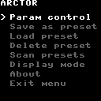

Arctor's main menu displays all its functions. Generally speaking, **click** to enter a menu, select a parameter, or enter a value, and **hold** to exit a menu or cancel.

## Param control
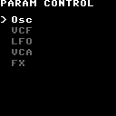

This is where you can edit Arctor's sound. The first thing you'll see is a list of subcategories for Arctor's oscillators, filter (VCF), LFO, VCA, and built-in effects.

In param control mode:
- The cursor will display the current parameter a little brighter than the others.
- Clicking into it will highlight that parameter on a white background, and you can then turn the encoder to adjust the parameter value.
- Click to confirm the adjustment, double-click to return to the INIT default for that parameter, or hold to cancel editing and return to the most recently-stored value for that parameter.

*A couple notes about using MIDI CC with Arctor:*

1. CC data you send into Arctor will be reflected in real-time on the corresponding parameter(s). Saving as Arctor preset captures the current state of every parameter, including adjustments from external CC data. If you're editing a sound via an external MIDI controller, your DAW, etc., saving the preset on the AMYboard itself will capture all of those modifications. 
2. If you leave the cursor idle on a parameter for a few seconds, it will display its corresponding CC number, to make it easy to assign a controller to it. You can also consult the complete CC table in the [appendix](#appendix).

### Osc

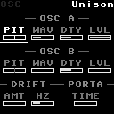 

| Controls |
| --- |
| **A/B PIT** - pitch (centered is A440; moving in either direction repitches first by an increasing amount of detune, then jumping to a fifth, an octave, and finally two octaves) for each oscillator|
| **A/B WAV** - waveshape (sine, pulse, saw down, saw up, triangle, noise) for each oscillator|
| **A/B DTY** - duty cycle (only applies when WAV is set to pulse) for each oscillator|
| **A/B LVL** - level for each oscillator|
| **DRIFT AMT** - depth of "warble" effect, a smooth-random pitch modulation that simulates a vintage analog synth or a wobbly tape recorder (affects both oscillators) |
| **DRIFT HZ** - rate of "warble" effect |
| **PORTA TIME** - off by default; turning the knob up activates portamento and increases its length (affects both oscillators) |

### VCF

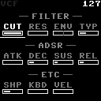 

| Controls |
| --- |
| **CUT** - cutoff frequency of the filter |
| **RES** - resonance of the filter |
| **ENV** - a bipolar control that determines which direction, and how strongly, the filter envelope opens the filter |
| **TYP** - filter type - selects from LP (low pass), LP24 (a higher-resonance low pass), BP (band pass), or HP (high pass) |
| **ATK** / **DEC** / **SUS** / **REL** - attack/decay/sustain/release envelope stage length |
| **SHP** - envelope shape - alters the filter envelope shape, getting incrementally "snappier" (linear, normal, true exponential, DX7) |
| **KBD** - keyboard amount - higher values make higher-pitched notes open the filter more than lower-pitched notes |
| **VEL** - velocity amount - higher values make higher-velocity notes open the filter more than lower-velocity notes |

### LFO

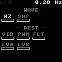

| Controls |
| --- |
| **WAVE HZ** - frequency of the LFO |
| **WAVE SHP** - shape of the LFO (sine, square, ramp up, ramp down, triangle, noise) |
| **DEST VIB** - strength of LFO's effect on vibrato (osc A and B) |
| **DEST PWM** - strength of LFO's effect on pulse wave modulation (only audible with oscillator(s) waveshape set to pulse) |
| **DEST FLT** - strength of LFO's effect on filter cutoff |
| **DEST LVA** - strength of LFO's effect on the level of osc A (tremolo) |
| **DEST LVB** - strength of LFO's effect on the level of osc B (tremolo) |

### VCA

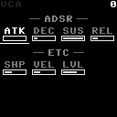 

| Controls |
| --- |
| **ATK** / **DEC** / **SUS** / **REL** - attack/decay/sustain/release envelope stage length |
| **SHP** - envelope shape - alters the amplitude envelope shape, getting incrementally "snappier" (linear, normal, true exponential, DX7) |
| **VEL** - velocity amount - higher values make the VCA envelope respond more sensitively to the velocity with which a note is triggered |
| **LVL** - overall level of the preset |

### FX

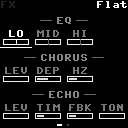
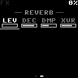

| Controls |
| --- |
| **LO** / **MID** / **HI** - gain adjustment for each EQ band |
| **CHORUS LEV** - gain adjustment for wet chorus signal |
| **CHORUS DEP** - depth of chorus modulation |
| **CHORUS HZ** - rate of chorus modulation |
| **ECHO LEV** - gain adjustment for wet echo signal |
| **ECHO TIM** - rate of echo |
| **ECHO FBK** - amount of echo feedback |
| **ECHO TON** - alters the tone of the echo feedback, making it duller or brighter |
| **REVERB LEV** - gain adjustment for wet reverb signal |
| **REVERB DEC** - length of reverb decay |
| **REVERB DMP** - reverb damping |
| **REVERB XVR** - reverb crossover frequency |

## Saving, loading, and deleting presets

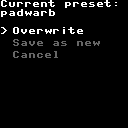
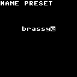
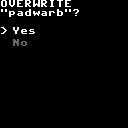
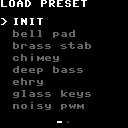
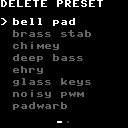
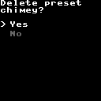

Arctor comes with 7 "factory" presets. The first in the list is INIT, a "default" that can't be overwritten and serves as a jumping-off point for creating your own sounds. You can delete or overwrite the other 6 however you want. Arctor can hold a total of 32 presets, not counting INIT.

When you select **save as preset**, Arctor will capture the current state of every parameter and give you the opportunity to either overwrite your current preset or **save as** with a new name. A preset name can be up to 12 characters: a–z, 0–9, space. After the characters comes a ⌫ that deletes the previous letter, and a ✓ to confirm save. If you enter the name of an existing preset, Arctor will ask you if you want to overwrite the current preset. If you change your mind, hold the encoder to cancel out of the save flow at any point&mdash;your parameters will stay how you had them set; you just won't save them into memory.

Presets are saved on your board, not inside arctor.py, so updating Arctor or upgrading your AMYboard's firmware through the online editor won't erase them. (A full flash-erase and reinstall is different: it wipes everything on the board, including Arctor itself. You'd reinstall Arctor and start again from the factory presets. If you need to wipe your AMYBoard and want to keep your saved presets, they can be found in /user/arctor_presets.json.)

## Scan presets

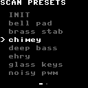

The Scan Preset function *looks* just like the Load Preset menu, but it **automatically loads presets as you scroll through the list**. This is handy for browsing/auditioning your presets without having to keep clicking "load" on each one. At any point, you can click on the encoder to bring you into param control for that preset.

n.b.: Unlike the standard "load preset" mode, "scan presets" will loop back to the beginning of the list when you hit the end, rather than stopping at the end of the list.

## Display mode

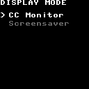

Determines what the screen will do when the app enters its "idle" screen state (15 seconds after the encoder is last touched, or when the user clicks "Exit menu").

### CC Monitor

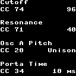

CC Monitor displays incoming MIDI CC data (if there is any), up to 4 CCs at a time, and scrolls old commands off after a few seconds. If there's no incoming CC data, it just stays blank.

### Screensaver

Screensaver just bonks a little square around like a classic DVD menu.

## About

Contains version information, credits, and the link to this page. If you're already here you probably don't need a screen render of it.

## Exit menu

Activates the selected display mode instantly, rather than waiting for the 15-second idle timeout.

## Appendix

### Changelog

| Date | Updates |
| --- | --- |
| 2026_08_01 | Initial release. |

### CC Table

| CC# | Parameter |
| --- | --- |
| 1 | Mod wheel — aliased to CC 77 (LFO → pitch), so a performance wheel controls vibrato depth out of the box |
| 20 | **Osc A** PIT — oscillator A pitch |
| 21 | **Osc A** WAV — oscillator A waveshape |
| 22 | **Osc A** DTY — oscillator A duty cycle (pulse only) |
| 23 | **Osc A** LVL — oscillator A level |
| 24 | **Osc B** PIT — oscillator B pitch |
| 25 | **Osc B** WAV — oscillator B waveshape |
| 26 | **Osc B** DTY — oscillator B duty cycle (pulse only) |
| 27 | **Osc B** LVL — oscillator B level |
| 28 | **Osc** DRIFT AMT — depth of the "warble" pitch drift |
| 29 | **Osc** DRIFT HZ — rate of the "warble" pitch drift |
| 30 | **VCF** ENV — filter envelope amount (bipolar) |
| 31 | **VCF** TYP — filter type (LP, LP24, BP, HP) |
| 32 | **VCF** KBD — keyboard tracking amount |
| 33 | **VCF** VEL — velocity → filter amount |
| 34 | **Osc** PORTA TIME — portamento/glide time (0 = off) |
| 40 | **VCF** ATK — filter envelope attack |
| 41 | **VCF** DEC — filter envelope decay |
| 42 | **VCF** SUS — filter envelope sustain |
| 43 | **VCF** REL — filter envelope release |
| 44 | **VCA** VEL — velocity → amp amount |
| 45 | **VCF** SHP — filter envelope shape |
| 46 | **VCA** SHP — amp envelope shape |
| 71 | **VCF** RES — filter resonance |
| 72 | **VCA** REL — amp envelope release |
| 73 | **VCA** ATK — amp envelope attack |
| 74 | **VCF** CUT — filter cutoff frequency |
| 75 | **VCA** DEC — amp envelope decay |
| 76 | **LFO** WAVE HZ — LFO rate |
| 77 | **LFO** DEST VIB — LFO → pitch (vibrato). Also the mod wheel, CC 1 |
| 78 | **LFO** WAVE SHP — LFO shape |
| 79 | **VCA** SUS — amp envelope sustain |
| 80 | **LFO** DEST FLT — LFO → filter cutoff |
| 81 | **LFO** DEST LVA — LFO → osc A level (tremolo) |
| 82 | **LFO** DEST LVB — LFO → osc B level (tremolo) |
| 83 | **LFO** DEST PWM — LFO → pulse width |
| 84 | **VCA** LVL — overall preset level |
| 85 | **FX** EQ LO — low band gain |
| 86 | **FX** EQ MID — mid band gain |
| 87 | **FX** EQ HI — high band gain |
| 90 | **FX** CHORUS LEV — wet chorus level |
| 91 | **FX** CHORUS DEP — chorus depth |
| 92 | **FX** CHORUS HZ — chorus rate |
| 95 | **FX** ECHO LEV — wet echo level |
| 96 | **FX** ECHO TIM — echo time |
| 97 | **FX** ECHO FBK — echo feedback |
| 98 | **FX** ECHO TON — echo tone |
| 100 | **FX** REVERB LEV — wet reverb level |
| 101 | **FX** REVERB DEC — reverb decay |
| 102 | **FX** REVERB DMP — reverb damping |
| 103 | **FX** REVERB XVR — reverb crossover frequency |
